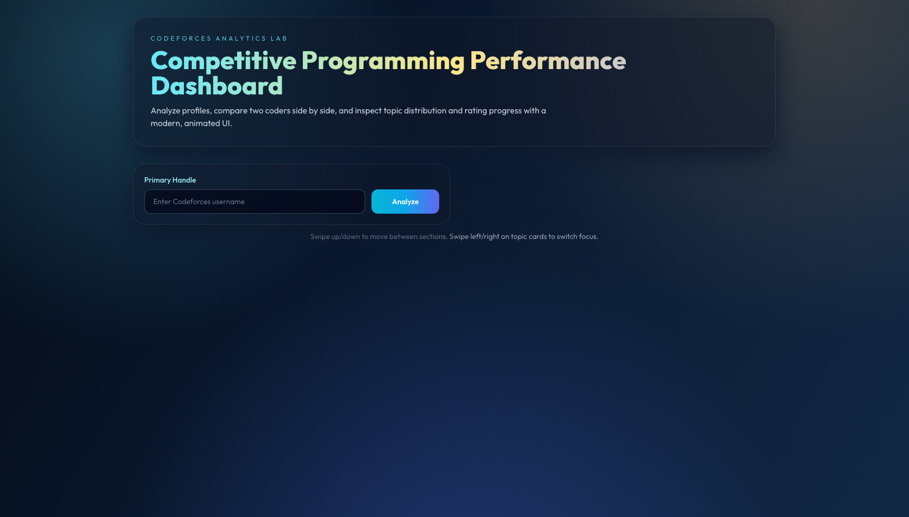
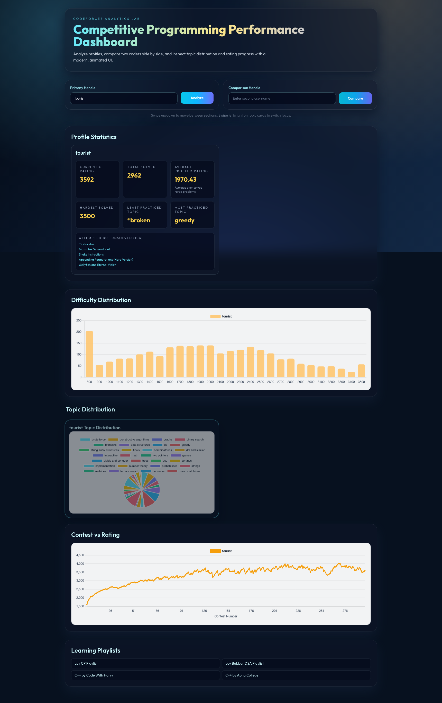

# CP Analyzer

An interactive **Codeforces performance dashboard** built for presentation-grade UI/UX.

It helps you analyze a profile, compare two users side-by-side, and visualize problem-solving behavior with motion-rich frontend interactions.

## Highlights
- Analyze any Codeforces handle in seconds
- Compare two profiles in a partitioned layout
- Difficulty distribution chart (bar)
- Topic distribution charts (parallel pie charts)
- Contest vs rating trend line chart
- Most practiced and least practiced topic insights
- Animated premium interface with smooth scrolling and cursor interactions

## Demo

### Live Interaction Preview (GIF)


### Demo Video (WebM)
Open directly: [cp-analyzer-demo.webm](media/demo/cp-analyzer-demo.webm)

## Screenshots

### Hero Section


### Analyzed Dashboard


### Compare Mode


## UI/UX Stack
- **Vite** (frontend tooling)
- **Tailwind CSS** (styling system)
- **GSAP + ScrollTrigger** (motion and scroll effects)
- **Lenis** (smooth scrolling)
- **Three.js** (animated background)
- **Chart.js** (data visualizations)

## Project Structure
```text
cp-analyzer/
├── index.html
├── src/
│   ├── main.js
│   └── style.css
├── tailwind.config.js
├── postcss.config.js
├── vite.config.js
└── package.json
```

## Getting Started

### 1. Clone
```bash
git clone https://github.com/DD-is-Here/cp-analyzer.git
cd cp-analyzer
```

### 2. Install
```bash
npm install
```

### 3. Run Development Server
```bash
npm run dev
```

### 4. Build for Production
```bash
npm run build
```

### 5. Preview Production Build
```bash
npm run preview
```

## Usage
1. Enter your primary Codeforces handle and click **Analyze**.
2. Add a second handle and click **Compare** for side-by-side insights.
3. Scroll through sections to inspect charts and practice patterns.

## Why This Project
This project combines **data analysis** and **modern frontend engineering**:
- Real API-driven profile analytics
- Strong visual storytelling for presentations
- Advanced interactions beyond basic dashboards

## License
MIT
